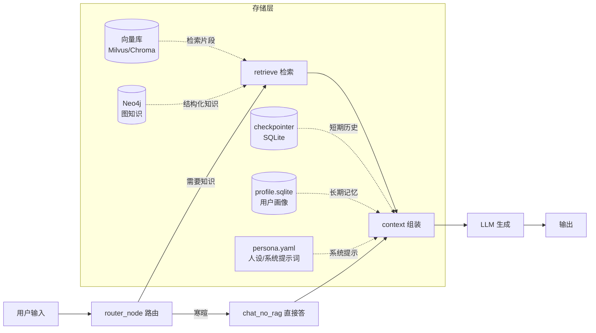

# Agent 上下文与数据存储 · 可上线实现方案

> 目标：把「上下文怎么做、数据存哪里」落到一份可直接照着写的工程方案。
> 技术栈按你现有的 LangGraph + SiliconFlow + Neo4j 对齐。

---

## 一、核心原则（先记住这 3 条）

1. **上下文不是存起来的东西，是每次调用现场拼的一段话。** 拼进去的每个 token 都要花延迟和钱。
2. **按需注入，绝不全量塞。** 人设、工具、检索结果、历史，都是"用到才拼"。
3. **短期、长期、知识分开存。** 三者的生命周期和介质完全不同，混在一起必乱。

---

## 二、总体架构



数据流一句话总结：**路由决定走哪条路 → 检索/记忆把该带的数据捞出来 → context 现场拼成 messages → 发给 LLM。**

---

## 三、目录结构

```
agent/
├── config/
│   ├── persona.yaml          # 人设 / 系统提示词（唯一来源）
│   └── skills/               # 工具/技能定义，按需加载
├── core/
│   ├── state.py              # State 字段定义
│   ├── graph.py              # 图定义（节点 + 边）
│   ├── context.py            # 上下文组装（核心）
│   ├── memory.py             # 长期记忆（用户画像）
│   └── retriever.py          # 检索注入（向量 + 图）
├── store/                    # 运行时自动生成，进 .gitignore
│   ├── checkpoints.sqlite    # 会话历史
│   └── profile.sqlite        # 用户画像
└── main.py                   # 入口
```

---

## 四、数据存放总表（先定介质）

| 数据类型 | 存放位置 | 生命周期 | 上线用介质 |
|---|---|---|---|
| 系统提示词/人设 | `config/persona.yaml` | 随版本发布 | 配置文件（不进库） |
| 短期对话记忆 | checkpointer | 单会话内 | `SqliteSaver`（本地文件） |
| 长期记忆/画像 | `profile.sqlite` | 跨会话永久 | SQLite（可换 Postgres） |
| 知识检索片段 | 向量库 + 原始文档 | 永久 | Chroma（轻量）/ Milvus（量大） |
| 结构化关系知识 | 图数据库 | 永久 | Neo4j |
| 工具/技能定义 | `config/skills/` | 随版本发布 | 配置文件，命中意图才加载 |

**升级路径**：单机上线先用 SQLite + Chroma，量大后再切 Postgres + Milvus，接口不变。

---

## 五、State 定义（`core/state.py`）

```python
from typing import TypedDict, Annotated
from langgraph.graph.message import add_messages


class ChatState(TypedDict):
    # 对话历史：add_messages 让每轮 user/assistant 自动累积
    messages: Annotated[list, add_messages]

    # 本轮原始问题（路由用）
    question: str

    # 旧对话摘要：历史超出窗口时把旧的部分压成这一段
    summary: str

    # 检索结果：retrieve 节点写入，context 节点读取
    retrieved: list[dict]

    # 路由结果：chat_no_rag / retrieve
    route: str

    # 用户画像：长期记忆，跨会话读取
    profile: dict
```

---

## 六、分模块具体实现

### 6.1 系统提示词（`config/persona.yaml`）

人设单独放配置文件，**控制在 500 token 以内**，别把全部规则塞进去。

```yaml
# persona.yaml
name: 文旅问答助手
role: 安徽省文旅知识问答，只答文旅相关问题
tone: 简洁、准确，数字必带单位
output_rules:
  - 结论放最前面，再给依据
  - 数字必须带单位（元、人次、天）
  - 3 项以上并列用表格
  - 禁止只给链接不给结论
constraints:
  - 不确定就明说"我不确定"，不要编造
```

### 6.2 短期记忆：checkpointer（`main.py`）

```python
from langgraph.checkpoint.sqlite import SqliteSaver

# 上线用 SQLite 落盘；开发调试可用 MemorySaver
checkpointer = SqliteSaver.from_conn_string("store/checkpoints.sqlite")

graph = workflow.compile(checkpointer=checkpointer)

# 同一 thread_id 即同一会话，历史自动带上
result = graph.invoke(
    {"question": "合肥有哪些 5A 景区"},
    config={"configurable": {"thread_id": "user_10086"}},  # 关键：按用户/会话隔离
)
```

**关键点**：`thread_id` 用 `user_id + 会话号` 拼，保证多用户、多会话互不串。

### 6.3 对话历史裁剪：滑动窗口 + 摘要（`core/context.py`）

历史不能无限带，超过窗口就压缩。核心函数：

```python
MAX_TURNS = 6          # 最多保留最近 6 轮（12 条消息）
MAX_HISTORY_TOKENS = 2000


def trim_history(messages: list, max_turns: int = MAX_TURNS):
    """超出窗口的旧消息，交给 LLM 压成一段摘要"""
    recent = messages[-max_turns * 2:]      # 最近 N 轮 = 2N 条
    old = messages[:-max_turns * 2:]
    summary = ""
    if old:
        summary = summarize(old)            # 调 LLM 把 old 压成 100~200 字
    return summary, recent


def summarize(messages: list) -> str:
    """把旧对话压成一段摘要，避免 token 无限增长"""
    prompt = "把以下对话压缩成一段不超过 150 字的摘要，保留关键结论：\n" + \
             "\n".join(f"{m.type}: {m.content[:200]}" for m in messages)
    return llm.invoke(prompt)   # llm 走 SiliconFlow 接口
```

### 6.4 检索注入（`core/retriever.py`）

**向量检索**（非结构化文本，如景区评论、政策）：

```python
TOP_K = 4                # 只召回最相关的 4 条，别贪多
MAX_CHUNK = 300          # 每条片段截断到 300 字

def retrieve_vectors(query: str, store) -> list[dict]:
    hits = store.similarity_search(query, k=TOP_K)
    return [{"text": h.page_content[:MAX_CHUNK], "score": h.score} for h in hits]
```

**图检索**（结构化关系，如景区→城市→星级）：

```python
def retrieve_graph(query: str, driver) -> list[dict]:
    # 只有当问题命中"关系类"意图时才走 Neo4j，平时不查
    cypher = """
    MATCH (s:ScenicSpot)-[:LOCATED_IN]->(c:City)
    WHERE c.name CONTAINS $kw OR s.name CONTAINS $kw
    RETURN s.name, s.rating, c.name LIMIT 8
    """
    with driver.session() as sess:
        return sess.run(cypher, kw=query).data()
```

> **路由决定检索**：寒暄直接走 `chat_no_rag`，不碰向量库/图库——这就是前面优化里"greeting 跳过 retrieve"的落地意义。

### 6.5 长期记忆：用户画像（`core/memory.py`）

跨会话记住用户偏好，存 SQLite 一张表：

```python
import sqlite3

SCHEMA = """
CREATE TABLE IF NOT EXISTS profile (
    user_id TEXT PRIMARY KEY,
    facts    TEXT,        -- JSON：偏好、身份、历史结论
    updated  TEXT
);
"""

def get_profile(user_id: str) -> dict:
    row = conn.execute("SELECT facts FROM profile WHERE user_id=?", (user_id,)).fetchone()
    return json.loads(row[0]) if row else {}

def save_profile(user_id: str, facts: dict):
    conn.execute(
        "INSERT OR REPLACE INTO profile(user_id, facts, updated) VALUES(?,?,?)",
        (user_id, json.dumps(facts, ensure_ascii=False), now()),
    )
```

画像示例：`{"city": "合肥", "偏好": ["5A景区", "周末游"], "预算": "1000元/人"}`，每次组装时把画像压成一句注入 system。

---

## 七、上下文组装（核心，`core/context.py`）

把上面所有东西拼成一次 LLM 调用的 messages：

```python
def build_messages(state: ChatState) -> list:
    # 1. 系统提示词（人设 + 画像 + 摘要）
    persona = render_persona("config/persona.yaml")
    profile = state.get("profile") or {}
    system_parts = [persona]

    if state.get("summary"):
        system_parts.append(f"[历史摘要] {state['summary']}")
    if profile:
        system_parts.append(f"[用户画像] {json.dumps(profile, ensure_ascii=False)}")

    # 2. 检索结果（仅 retrieve 路由时才有，按需注入）
    if state.get("retrieved"):
        kb = "\n".join(f"- {r['text']}" for r in state["retrieved"])
        system_parts.append(f"[参考资料]\n{kb}")

    # 3. 工具定义（命中意图才注入 schema，不命中不拼）
    tools = load_tools(state["route"]) if need_tools(state) else []

    return [
        {"role": "system", "content": "\n\n".join(system_parts)},
        *state["messages"],        # 已裁剪的历史 + 本轮问题
    ]
```

**组装顺序固定为**：系统提示 → 检索参考 → 历史 → 本轮问题。顺序别乱，模型对开头和结尾最敏感。

---

## 八、Token 预算（上线前定死，防超）

假设模型上下文窗口 32k，按下面分配，**预留 8k 给生成**：

| 部分 | 预算 | 裁剪手段 |
|---|---|---|
| 系统提示词 | ≤ 800 | persona 精简 + 画像一句 |
| 历史摘要 | ≤ 200 | 150 字封顶 |
| 对话历史 | ≤ 2000 | 滑动窗口 6 轮 |
| 检索片段 | ≤ 3000 | top-k=4 × 300 字截断 |
| 工具定义 | ≤ 800 | 按需加载 |
| **合计（输入）** | **≤ 6800** | 远低于窗口，留足生成空间 |

**估算方法**：中文粗略按 1 字 ≈ 1.5 token 算，写个计数器在拼装后打印 `len(context)` 做兜底告警，超了就自动再砍一轮历史。

---

## 九、上线 Checklist

- [ ] `persona.yaml` 人设 ≤ 500 字，规则别堆进 system
- [ ] checkpointer 用 `SqliteSaver` 落盘，`thread_id` 按用户隔离
- [ ] 历史加了滑动窗口（6 轮）+ 摘要，不会无限增长
- [ ] 检索 `top_k ≤ 4`，每条片段 ≤ 300 字截断
- [ ] 寒暄走 `chat_no_rag`，不触发向量/图检索
- [ ] 长期画像落 `profile.sqlite`，随会话更新
- [ ] 拼装后打印 token 数做兜底告警
- [ ] `store/` 目录进 `.gitignore`，不提交用户数据
- [ ] 敏感数据（手机号、身份证）脱敏后再存画像

---

## 十、三个最容易踩的坑

1. **历史无限累积** → 会话越长越慢越贵，必须滑动窗口 + 摘要。
2. **全量塞 skills/工具** → 每次调用都拼进所有工具 schema，token 暴涨；改成命中意图才加载。
3. **把上下文存成一个"大 JSON"想复用** → 上下文是拼出来的，不是存的；要复用就存"原料"（画像、检索片段、摘要），不是存"成品"。

---

需要的话，下一步我可以直接按这个结构，把你 `graph.py` 里现有的 State 和节点改造成 `state.py + context.py + memory.py` 这套拆分。
